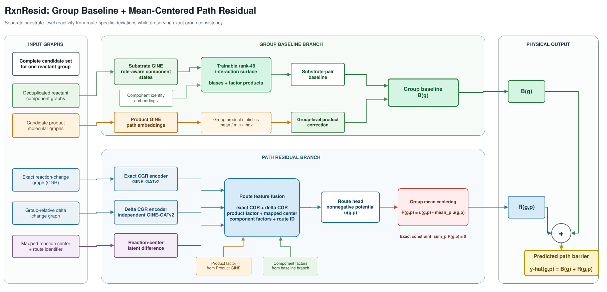

# RxnResid



RxnResid predicts activation barriers for candidate reaction paths that share
the same reactants. The model decomposes each prediction into a group-level
baseline and a path-specific residual:

```text
barrier(group, path) = baseline(group) + residual(group, path)
```

The editable architecture diagram is available in
[`assets/rxnresid-architecture.drawio`](assets/rxnresid-architecture.drawio).

## Model

The baseline branch represents the reactivity shared by every path in a
reactant group. A GINE encoder processes deduplicated reactant components, and
learned component identities parameterize a low-rank interaction surface. A
separate product encoder aggregates the complete candidate set and supplies a
group-level correction.

The residual branch distinguishes routes within the group. Independent
GINE-GATv2 encoders process the exact reaction-change graph and its path-local
features. Their representations are fused with product, reactant-component,
route-identity, and mapped reaction-center features. The path correction is
predicted directly for each concrete reaction.

The model also has a native evidential regression head. One forward pass
returns a Student-t predictive distribution and its aleatoric and epistemic
variance components. Product-group auxiliary features still use complete
groups during training, but path prediction and uncertainty are path-local, so
a single reaction can be scored independently at inference time.

## Setup

RxnResid supports Python 3.11 through 3.13 and uses `uv` for dependency
management:

```bash
git clone <repository-url>
cd RxnResid
make setup
```

CUDA users can install PyTorch Geometric extension wheels matched to the locked
PyTorch build with:

```bash
make pyg-accelerators
```

## Data

Input data is a path-wise CSV with one atom-mapped reaction candidate per row.
The default configuration expects:

| Column | Description |
| --- | --- |
| `rxn_smiles` | Atom-mapped reactants and candidate product |
| `G_T_activate` | Activation-barrier target |
| `ene_id`, `diene_id` | Reactant component identifiers |
| `prod_id` | Route identifier |

Paths are partitioned by reactant group to prevent a group from appearing in
more than one split. Dataset paths, column names, split metadata, and model
settings are defined in [`configs/rxnresid.yaml`](configs/rxnresid.yaml).

## Training

Train a fold from random initialization:

```bash
uv run python train.py \
  --config configs/rxnresid.yaml \
  --fold-index 0 \
  --output runs/fold-00
```

Run the group cross-validation scheduler:

```bash
uv run python scripts/run_cross_validation.py \
  --config configs/rxnresid.yaml \
  --output-root runs/cross-validation \
  --nproc-per-node 1 \
  --tasks-per-gpu 1 \
  --gpu-indices 0
```

Each fold directory contains the resolved configuration, split metadata,
training history, predictions, metrics, and checkpoint. Existing completed
folds are skipped when the scheduler is resumed.

## Inference

```bash
uv run python predict.py \
  --checkpoint runs/fold-00/checkpoint.pt \
  --data path/to/mapped_paths.csv \
  --output predictions.csv
```

The output reports the total prediction, baseline/residual components, and
physical-unit uncertainty fields:

```text
aleatoric_variance, epistemic_variance, predictive_variance
aleatoric_std, epistemic_std, predictive_std, lower_95, upper_95
```

`predictive_variance` is the sum of aleatoric and epistemic variance. These
values are emitted for each concrete reaction path. Input rows may be scored
individually; complete groups remain useful for training the auxiliary baseline
branch.

### Interpreting uncertainty

For one concrete reaction, RxnResid predicts an activation barrier together with
three path-local uncertainty components. The evidential head predicts Normal-
Inverse-Gamma parameters `(gamma, nu, alpha, beta)` in standardized target
units, and the reported physical-unit variances are:

```text
aleatoric_variance  = beta / (alpha - 1) * target_scale^2
epistemic_variance  = aleatoric_variance / nu
predictive_variance = aleatoric_variance + epistemic_variance
```

- `aleatoric_variance` is uncertainty that is intrinsic to the conditional
  reaction outcome or label. It can reflect unobserved conditions, conformers,
  experimental noise, or approximation noise in computed barriers. More
  training data does not necessarily remove it.
- `epistemic_variance` is uncertainty from limited model knowledge. It should
  increase for reactions that are poorly represented or out of distribution and
  is the natural score for epistemic active-learning selection. In this
  single-model evidential implementation it is a learned proxy, not a strict
  Bayesian posterior variance or ensemble disagreement.
- `predictive_variance` is the total uncertainty of the reported prediction and
  is the score used by the `predictive` acquisition strategy.

`*_variance` values have squared barrier units; `*_std` values have the same
units as `prediction`. `lower_95` and `upper_95` use the normal approximation
`prediction +/- 1.96 * predictive_std`. Calibration and interval coverage
should be checked on a held-out set before treating these intervals as
probabilistic guarantees. For deterministic DFT targets, aleatoric uncertainty
should be interpreted mainly as label/model-discrepancy uncertainty rather than
literal experimental variability.

High aleatoric but low epistemic uncertainty means the model knows the reaction
but expects an intrinsically broad outcome distribution. Low aleatoric but high
epistemic uncertainty means the reaction may be learnable, but the training
coverage is insufficient. Both components are computed for the individual
reaction path, without an ensemble or averaging over alternative substrate
groups.

For active learning, rank the returned `PredictionRecord` objects directly:

```python
from rxnresid.analysis.acquisition import select_acquisition

selected = select_acquisition(records, "epistemic", count=100, seed=42)
```

The available strategies are `predictive`, `epistemic`, `aleatoric`, and
`random`. The evidential head is a newly trained output head; existing
checkpoints must be retrained or explicitly fine-tuned before uncertainty
values are used.

For a single mapped reaction, call the one-forward inference API directly:

```python
from rxnresid.inference import predict_one

record = predict_one(
    "runs/fold-00/checkpoint.pt",
    "[CH2:1]=[CH:2][CH:3]=[CH:4]>>[CH2:1]1[CH:2][CH:3][CH:4]1",
    route_id=0,
    conditions={},  # required only when data.condition_columns is non-empty
    device="cpu",
)
print(record.prediction)
print(record.aleatoric_variance, record.epistemic_variance, record.predictive_variance)
print(record.predictive_std, record.lower_95, record.upper_95)
```

The same operation is available from the command line:

```bash
uv run python examples/predict_one.py \
  --checkpoint runs/fold-00/checkpoint.pt \
  --reaction '[CH2:1]=[CH:2][CH:3]=[CH:4]>>[CH2:1]1[CH:2][CH:3][CH:4]1' \
  --route-id 0 --cpu
```

## Repository

```text
assets/         model architecture source and rendering
configs/        model, data, and training configuration
data/           input data and group split manifest
scripts/        data preparation and training utilities
src/rxnresid/   model and training package
tests/          unit and integration tests
train.py        training entry point
predict.py      inference entry point
```

Generated runs and local caches are excluded from version control. Use
`make check` for formatting, linting, and static type checks, and `make test`
for the test suite.

## License

RxnResid is available under the terms of the [MIT License](LICENSE).
